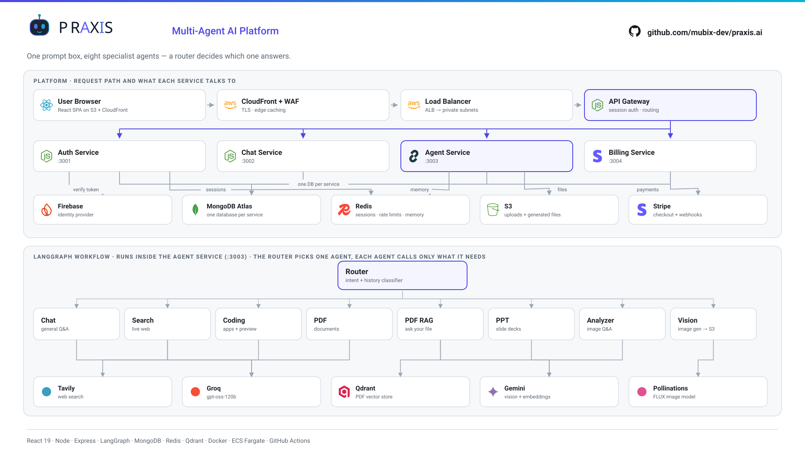
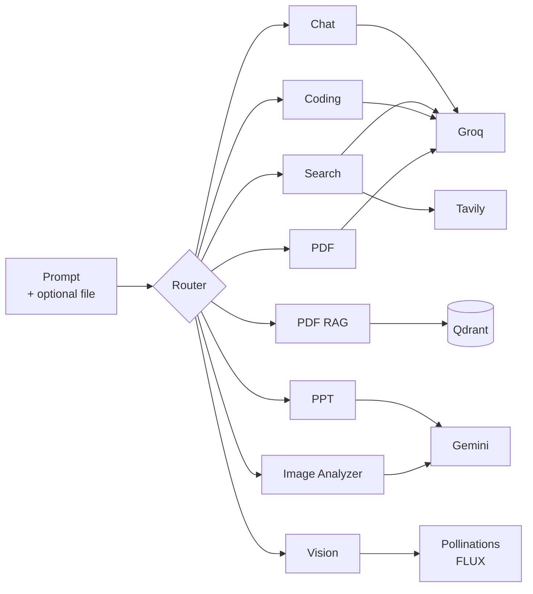

<div align="center">

# Praxis.ai

**A multi-agent AI platform that routes every request to the right specialist.**

Ask a question, search the live web, generate a full website with a live preview, build a PDF or a slide deck, create an image, or chat with an uploaded document — all from one prompt box, on a credit-based billing system.

<a href="https://github.com/mubix-dev/praxis.ai"><strong>github.com/mubix-dev/praxis.ai</strong></a>

<br/>


</div>

---

## Table of contents

- [What it does](#what-it-does)
- [The agents](#the-agents)
- [Architecture](#architecture)
- [How a request flows](#how-a-request-flows)
- [Tech stack](#tech-stack)
- [Repository layout](#repository-layout)
- [Running locally](#running-locally)
- [Environment variables](#environment-variables)
- [Credits and billing](#credits-and-billing)
- [Deployment](#deployment)

---

## What it does

Praxis is built around one idea: **a single prompt box should not mean a single model.**

You type a request. A router agent reads it, decides which specialist should handle it, and hands off. You never pick a tool — though you can, if you want to force one.

- **Auto-routing** — a classifier picks the agent from your wording and the recent conversation
- **Live web search** with cited sources and inline images
- **Code generation** into an artifact panel with a runnable preview
- **Document generation** — real downloadable PDFs and PowerPoint decks
- **Image generation** from a photography-grade prompt the model writes for you
- **Chat with your files** — upload a PDF and ask questions against its contents (RAG)
- **Image understanding** — upload a photo and ask about it
- **Credit billing** through Stripe Checkout, with per-agent pricing and per-minute rate limits

---

## The agents

Every request enters a LangGraph state machine. The router node classifies it, then a conditional edge dispatches to exactly one specialist.

| Agent | What it handles | Powered by |
|---|---|---|
| **Router** | Classifies the request, considers recent history | Groq |
| **Chat** | General conversation, explanations, programming concepts | Groq |
| **Search** | Live web results, current events, finding real photos | Tavily + Groq |
| **Coding** | Builds apps and components, debugs, reviews, refactors | Groq |
| **PDF** | Generates written documents and reports as real PDFs | Groq + PDFKit |
| **PDF RAG** | Answers questions about an uploaded PDF | Qdrant + Gemini embeddings |
| **PPT** | Generates downloadable PowerPoint decks | Gemini + PptxGenJS |
| **Vision** | Generates new images from a description | Groq + Pollinations (FLUX) |
| **Image Analyzer** | Describes and answers questions about uploaded images | Gemini |

Attach a file and routing is decided by MIME type — images go to the analyzer, PDFs go to RAG — regardless of what the classifier would have picked.

**Per-minute rate limits** (per user, tracked in Redis): chat 10, search 8, PDF 3, PPT 3, image 3, coding 2.

---

## Architecture



<sub>A PNG export for slides and posts lives at <a href="docs/architecture.png"><code>docs/architecture.png</code></a> (1920×1080).</sub>

Inside the agent service, every request runs through a LangGraph state machine:



An attached file overrides the classifier: images go straight to the analyzer, PDFs to RAG.

### Why a gateway

Every service is private. Only the gateway is exposed through the load balancer, and it does three jobs:

1. **Session authentication** — reads the `sessionId` cookie, validates it against Redis, and rejects anything unauthenticated
2. **Identity injection** — forwards the resolved user as an `x-user-id` header so downstream services never parse cookies
3. **Routing** — proxies `/api/auth`, `/api/chat`, `/api/agent` and `/api/billing` to the right service

The one deliberate exception is `POST /api/billing/webhook`. Stripe sends no cookies, and its signature is computed over the exact raw request bytes — so that route is mounted **before** both the auth middleware and the JSON body parser, and streams the body through untouched. Parsing and re-serializing it would invalidate the signature.

### Service boundaries

Each service owns its own MongoDB database — `auth`, `chat`, `agent`, `billing`. Nothing reaches across into another service's collections. Credits live only in the billing service, and the agent service spends them over HTTP using a shared internal API key.

---

## How a request flows

Sending *"build me a landing page"*:

1. Browser `POST /api/agent/chat` with the session cookie
2. CloudFront → ALB → **Gateway**
3. Gateway validates the session in Redis, injects `x-user-id`, proxies to the **Agent Service**
4. LangGraph **router** classifies it as `coding`
5. The coding agent checks the per-minute rate limit, then calls **Billing** to deduct credits
6. It loads recent conversation memory from Redis, including any previous artifact so follow-ups can modify the existing project
7. The LLM returns a JSON artifact — title, framework, and complete files
8. The backend builds the live preview by inlining the CSS and JS into the HTML
9. Messages are persisted to Redis (short-term memory) and to the **Chat Service** (durable history)
10. The response returns with the artifact, and the frontend opens the artifact panel

---

## Tech stack

**Frontend**

| | |
|---|---|
| Framework | React 19 + Vite |
| Styling | Tailwind CSS 4 |
| State | Redux Toolkit |
| Routing | React Router 7 |
| Auth | Firebase Authentication |
| UI | Framer Motion, Lucide icons, react-markdown, react-syntax-highlighter |

**Backend**

| | |
|---|---|
| Runtime | Node.js, Express 5, ES modules |
| Orchestration | LangChain + LangGraph |
| Models | Groq (`openai/gpt-oss-120b`), Google Gemini, OpenRouter |
| Databases | MongoDB Atlas (one per service), Redis, Qdrant |
| Files | AWS S3, Multer, MuPDF, PDFKit, PptxGenJS |
| Payments | Stripe Checkout + webhooks |
| Search | Tavily |

**Infrastructure**

| | |
|---|---|
| Containers | Docker on ECS Fargate |
| Registry | Amazon ECR |
| Edge | Application Load Balancer, CloudFront, AWS WAF |
| Static hosting | S3 + CloudFront |
| CI/CD | GitHub Actions |

---

## Repository layout

```
.
├── backend
│   ├── gateway/              API gateway — auth, routing, proxying
│   ├── services
│   │   ├── auth/             Firebase login, sessions, user records
│   │   ├── chat/             Conversations and message history
│   │   ├── agent/            LangGraph multi-agent workflow
│   │   │   ├── agents/       One file per specialist agent
│   │   │   ├── graph/        State graph, router, workflow wiring
│   │   │   └── utils/        Models, memory, credits, S3, rate limits
│   │   └── billing/          Credits, Stripe checkout and webhooks
│   ├── shared/redis/         Shared Redis client
│   └── .dockerignore         Build-context ignore for every image
├── frontend
│   └── src
│       ├── components/       UI, chat surface, artifact panel
│       ├── features/         API calls
│       ├── redux/            Store and slices
│       └── pages/            Landing, chat, payment result
└── .github/workflows/        Build, push to ECR, deploy to ECS
```

---

## Running locally

**Prerequisites:** Node.js 20+, Docker (for Redis), and a MongoDB Atlas connection string.

```bash
git clone https://github.com/mubix-dev/praxis.ai.git
cd praxis.ai
```

**1. Start Redis**

```bash
cd backend && docker compose up -d
```

**2. Install dependencies** — each service has its own `package.json`:

```bash
cd backend && npm install
for s in gateway services/auth services/chat services/agent services/billing; do
  (cd $s && npm install)
done
cd ../frontend && npm install
```

**3. Add a `.env` to each service** — see [Environment variables](#environment-variables). Also place your Firebase Admin `serviceAccountKey.json` in `backend/services/auth/`.

**4. Run everything** — five terminals, or a process manager:

```bash
cd backend/gateway          && npm run dev   # :3000
cd backend/services/auth    && npm run dev   # :3001
cd backend/services/chat    && npm run dev   # :3002
cd backend/services/agent   && npm run dev   # :3003
cd backend/services/billing && npm run dev   # :3004
cd frontend                 && npm run dev   # :5173
```

**5. Stripe webhooks** — Stripe needs a public URL, so forward locally:

```bash
stripe listen --forward-to localhost:3000/api/billing/webhook
```

Copy the printed `whsec_...` into the billing service's `STRIPE_WEBHOOK_SECRET`. Test with card `4242 4242 4242 4242`.

> Use `stripe trigger` only for smoke tests — its synthetic sessions carry no metadata, so no credits are added. Only a real checkout exercises the full path.

---

## Environment variables

Every service reads its own `.env` locally. **In production these come from the ECS task definition, not from files** — `.env` is excluded from the Docker build context.

<details>
<summary><strong>gateway</strong></summary>

```ini
PORT=3000
AUTH_SERVICE=http://localhost:3001
CHAT_SERVICE=http://localhost:3002
AGENT_SERVICE=http://localhost:3003
BILLING_SERVICE=http://localhost:3004
CLIENT_URL=http://localhost:5173      # exact frontend origin, used for CORS
REDIS_URL=redis://localhost:6379
```
</details>

<details>
<summary><strong>services/auth</strong></summary>

```ini
PORT=3001
MONGO_URI=mongodb+srv://.../auth
REDIS_URL=redis://localhost:6379
CLIENT_URL=http://localhost:5173
```
Also requires `serviceAccountKey.json` (Firebase Admin) in the service directory.
</details>

<details>
<summary><strong>services/chat</strong></summary>

```ini
PORT=3002
MONGO_URI=mongodb+srv://.../chat
```
</details>

<details>
<summary><strong>services/agent</strong></summary>

```ini
PORT=3003
MONGO_URI=mongodb+srv://.../agent
REDIS_URL=redis://localhost:6379

GROQ_API_KEY=
GOOGLE_API_KEY=
OPENROUTER_API_KEY=
TAVILY_API_KEY=

QDRANT_ENDPOINT=
QDRANT_API_KEY=

AWS_REGION=
AWS_ACCESS_KEY=
AWS_SECRET_KEY=
AWS_BUCKET_NAME=

CHAT_SERVICE=http://localhost:3002
BILLING_SERVICE=http://localhost:3004
INTERNAL_API_KEY=                     # must match the billing service
```
</details>

<details>
<summary><strong>services/billing</strong></summary>

```ini
PORT=3004
MONGO_URI=mongodb+srv://.../billing
STRIPE_SECRET_KEY=sk_...
STRIPE_WEBHOOK_SECRET=whsec_...       # from your webhook endpoint, per Stripe mode
CLIENT_URL=http://localhost:5173      # Stripe success/cancel redirects
INTERNAL_API_KEY=                     # must match the agent service
```
</details>

<details>
<summary><strong>frontend</strong></summary>

```ini
VITE_SERVER_URL=http://localhost:3000
VITE_FIREBASE_API_KEY=
```
</details>

---

## Credits and billing

New accounts start with **50 credits**. Each agent charges per response, and a hard ceiling of **350 credits** is enforced at checkout so nobody stockpiles.

| Plan | Price | Credits |
|---|---|---|
| Starter | $0.99 | 60 |
| Student | $1.99 | 150 |
| Pro | $2.99 | 300 |

Purchase flow: the frontend calls `POST /api/billing/checkout`, the billing service creates a Stripe Checkout Session carrying `userId` and `credits` in its metadata, and the user is redirected to Stripe. On `checkout.session.completed`, the webhook reads that metadata and increments the balance.

Deduction happens inside each agent before the model call, via an internal `POST /deduct` protected by `INTERNAL_API_KEY`. If a balance falls short mid-request, the remainder is taken rather than failing after the work is already done.

---

## Deployment

Pushing to `main` triggers `.github/workflows/deploy.yaml`:

**Backend** — builds five Docker images (build context is `backend/`, one Dockerfile per service), pushes each to Amazon ECR, then forces a new deployment on the matching ECS Fargate service.

**Frontend** — builds the Vite bundle, syncs it to S3, and invalidates the CloudFront distribution.

### Edge configuration worth knowing

These live in the AWS console, not in this repo, and each one has bitten this project:

- **CloudFront origin response timeout** — defaults to 30s, console maximum 60s. Long code generations exceed it, and CloudFront's own timeout page carries no CORS headers, so the browser misreports it as a CORS failure.
- **ALB idle timeout** — defaults to 60s. Raise it alongside the CloudFront timeout or it cuts first.
- **AWS WAF** — CloudFront can auto-attach a managed rule set. `SizeRestrictions_BODY` blocks bodies over 8 KB and `CrossSiteScripting_BODY` false-positives on binary data, so **every file upload is blocked at the edge** until the body-inspection rules are set to Count.
- **CORS** — `CLIENT_URL` on the gateway must exactly match the frontend origin, no trailing slash.

> If the browser reports a CORS error, check whether the response actually came from your server. A header-less error page usually means CloudFront or WAF answered instead — the CORS message is a symptom, not the cause.

### Secrets

`.env` files and `node_modules` are excluded from the Docker build context by `backend/.dockerignore` — which must live at the **build-context root** to be read at all, since Docker ignores nested ones. All runtime configuration comes from ECS task definitions.

One exception: `serviceAccountKey.json` ships inside the auth image because the service imports it at startup. Moving it to AWS Secrets Manager is the natural next step.

---

<div align="center">

Built by **Mubeen Khan**

[github.com/mubix-dev/praxis.ai](https://github.com/mubix-dev/praxis.ai)

</div>
